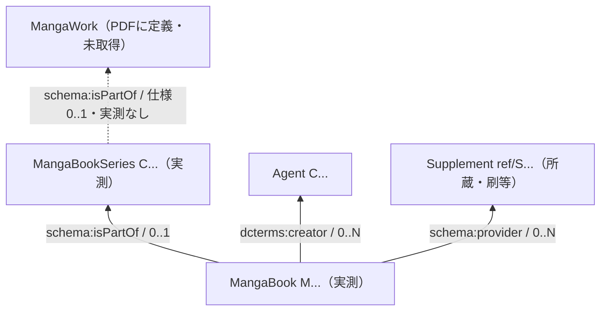

# Phase 2A: MADB 調査・実装仕様案

調査日: **2026-09-24 (JST)**。対象: Phase 1 / 0.1.12。
状態: **調査・設計の成果物。production implementation / merge は未実施。**

## 1. 目的と結論

NDL Search を補完する MADB source の境界を、公式仕様と実データから定める。
本書、[実例台帳](research/madb/examples.md)、[検証記録](research/madb/evidence.json)、
[実行クエリ](research/madb/queries/) が Phase 2A の成果物である。

- Book / Series / ISBN / 巻次 / レーベル / 責任表示は取得できる。
- **MangaWork は PDF に定義されるが、現行のクラス Turtle に宣言がなく、
  最新リリースにも該当ファイルがなく、endpoint の存在確認も 0 件だった。**
  Work を必須にした実装は開始できない。
- 正準 URI は `https://mediaarts-db.artmuseums.go.jp/id/`。
  **実際の query 用 namespace は `data/class#` / `data/property#` / `https://schema.org/`**。
  PDF と定義 Turtle にある `/` / `http://schema.org/` をそのままクエリに使わない。
- NDL 直接参照が存在する。Book の `ma:dataUrl` と所蔵 Supplement の資料 ID を別々に保持する。
  `ma:jpno` は全国書誌番号、Agent の `ma:ndla` は典拠 URI であり、NDL Bib ID ではない。
- 最初の汎用 linkage 候補は **検証済み ISBN-13 の一致（ISBN-10 を正規化）**。
  NDL の明示的な書誌 URL がある場合は、より強い裏付けとして先に照合する。
  候補重複・異版・複数 ISBN があるため、自動採用や自動上書きはしない。

本調査でできなかったことを成功として扱わない。特に「Work を実データで取得」および
「電子版の識別」は未達であり、ユーザー指定の Phase 2B entry criteria 全体は未充足。

## 2. 公式情報源・版・利用条件

| ID | 公式情報源 | 確認内容 |
|---|---|---|
| S1 | [MADB 本体](https://mediaarts-db.artmuseums.go.jp/) / [説明](https://mediaarts-db.artmuseums.go.jp/about) | 国立美術館国立アートリサーチセンターが 2023 年度から運営。旧 Web API は正式版公開に伴い廃止、SPARQL に代替 |
| S2 | [MADB Lab データ利用方法](https://mediag.bunka.go.jp/madb_lab/lod/howto/) | RDF、URI、全文検索、実行時間・連続呼び出し制限 |
| S3 | [公式 SPARQL 案内](https://mediag.bunka.go.jp/madb_lab/lod/sparql/) | 現行 endpoint |
| S4 | [公式 dataset repository](https://github.com/mediaarts-db/dataset) | URI 移行日、class code 一覧、データセット利用条件 |
| S5 | [最新 release 1.2.20](https://github.com/mediaarts-db/dataset/releases/tag/1.2.20) | 2026-09-18 公開、68 assets。README の旧ファイル名と現行 asset 名は異なる |
| S6 | [公式メタデータスキーマ PDF](https://github.com/mediaarts-db/dataset/blob/main/doc/MADBメタデータスキーマ仕様書.pdf) | Ver.1.2 / 2024-01-31、382 頁。Work pp.27–33、Series pp.33–44、Book pp.61–73、所蔵 pp.99–100 |
| S7 | [class Turtle](https://mediaarts-db.artmuseums.go.jp/data/class/) / [property Turtle](https://mediaarts-db.artmuseums.go.jp/data/property/) | 定義本文の日付 2024-01-31。配信 Content-Type は text/html、内容は Turtle |
| S8 | [MADB 利用規約](https://mediaarts-db.artmuseums.go.jp/user_terms) | 出典・加工表示、第三者の権利、CC BY 4.0 互換の説明 |
| S9 | [MADB Lab 利用規約](https://mediag.bunka.go.jp/madb_lab/user_terms/) | Lab コンテンツの利用条件 |

本体は SPA のため、HTTP HTML のみでは本文が読めない。S1/S8 の本文は本体が参照する
公開 `About-D-DvTXLd.js` / `Terms-AVSPq9aW.js` の日本語表示文字列を確認した。
一般の古い紹介記事や第三者 endpoint は仕様の根拠にしていない。

S4 はデータセットを自由に二次利用可能とし、加工表示、再利用可能である表記の保持等を依頼している。
S8/S9 はウェブコンテンツの条件であり、データセットの記載と混同しない。
このリポジトリの MIT License を MADB データのライセンスと扱わない。
本書の実例・集計は「国立美術館国立アートリサーチセンター『メディア芸術データベース』を加工して作成」。
データセットは自由な二次利用が可能。作品画像・本文の再配布は対象外。

### 取得・再現条件

`metadata101_json.zip` 全 404,269 Book、`metadata104_json.zip` 全 139,130 Series をオフライン集計。
Book の `metadata101_ttl.zip` も取得して namespace と記述形式を照合。

| 配布物 | SHA-256 |
|---|---|
| metadata101_json.zip | `250548820717850a8783c7ac66465eb6875b2107898f3a06703dc79cf495ecf7` |
| metadata104_json.zip | `e47432ec0e03be3310814f6db0354a37024869b5d2a691b4b502c9478c40458b` |
| metadata101_ttl.zip | `b1b29fe484af6de61f47135bf89912c5840cf4f8ba721a2d14f081e9253c5f81` |
| 取得した仕様 PDF | `bb03c80faeaf81f89b1fce2b42a7d45799207a267625636b94ec8c0b7aa1cecd` |

endpoint は 2026-09-24 の観測で、dataset release と同一 snapshot である保証はない。
配布 Book JSON にはない `schema:provider` が endpoint では取得できた。
従って Book ZIP 単体の統計を endpoint 全体の所蔵・外部 ID coverage とみなさない。

## 3. endpoint と HTTP 実測

**`https://mediaarts-db.artmuseums.go.jp/sparql`**。認証情報を送らずに実行した。

通常の query は FROM / GRAPH 指定なしで取得できる。M381096 に限定した named graph 検索では
`http://aws.amazon.com/neptune/vocab/v01/DefaultNamedGraph` を確認した。
これは観測された内部 graph 名であり、全 dataset の唯一の graph や安定した公開契約とはしない。
production query でこの実装固有 URI を固定する必要はない。

| 項目 | 公式記載 / 実測 / 未確認の区別 |
|---|---|
| GET | `query` URL parameter、200 / SPARQL JSON 成功 |
| POST | `application/x-www-form-urlencoded` の `query`、200 成功。raw `application/sparql-query` は未試験 |
| SELECT / LIMIT | 成功。全件 query や負荷試験は実施せず |
| class / property filter | `a class:MangaBook`、`schema:isbn`、`schema:name` 成功 |
| ORDER BY / OFFSET | title query の安定順と `LIMIT 2 OFFSET 2` を確認 |
| JSON | `application/sparql-results+json; charset=UTF-8` |
| XML / CSV | Accept を XML / CSV に変えても JSON が返った。形式別利用成功とはしない。query cache hit も観測 |
| pagination | LIMIT/OFFSET は利用可能。snapshot isolation / continuation token は不明 |
| rate limit | S2: 短時間の連続呼び出しで IP を一時遮断する場合あり。数値・時間窓は明記なし |
| headers | `X-RateLimit-Limit: 300`、Remaining を観測。**300/分等とは断定しない** |
| timeout | S2: 推定実行時間が 60 秒を超える想定の request はエラー。実際の強制終了時間とは区別 |
| maximum rows | 一般 SELECT の上限不明。全文検索の maxResults 既定 10,000 を SELECT 上限と混同しない |
| User-Agent | 独自 research UA で成功。必須条件は不明 |
| authentication | 無認証で成功。将来の維持保証はない |
| CORS | `Access-Control-Allow-Origin: *` を観測。preflight/ブラウザー POST 全体は未試験 |
| maintenance | 調査時に応答、2026-09-18 release を確認。SLA・保守時間・長期安定性は不明 |

公式の全文検索は Neptune FTS を使用する（S2）。日本語の部分一致の将来候補だが、本調査の
動作確認は exact literal と既知 URI に限定した CONTAINS/REGEX/LCASE。FTS は未検証。
`LIMIT` が小さくても regex の全走査が安くなるとは限らないため、production の無制限 title regex は推奨しない。

## 4. namespace / URI / identifier policy

以下を本書の query とモデル内のプロパティ表の prefix とする。

```text
id:       https://mediaarts-db.artmuseums.go.jp/id/
ref:      https://mediaarts-db.artmuseums.go.jp/ref/
class:    https://mediaarts-db.artmuseums.go.jp/data/class#
ma:       https://mediaarts-db.artmuseums.go.jp/data/property#
madbdata: https://mediaarts-db.artmuseums.go.jp/data/property-data/
schema:   https://schema.org/
dcterms:  http://purl.org/dc/terms/
rdf:      http://www.w3.org/1999/02/22-rdf-syntax-ns#
rdfs:     http://www.w3.org/2000/01/rdf-schema#
xsd:      http://www.w3.org/2001/XMLSchema#
```

S2 の ID 規則: Item は `M`＋連番、Collection/Curation は `C`＋連番。
Supplement は `S`＋連番で `/ref/` に置かれ、永続性を担保しない。
`schema:identifier` は `M381096` のような literal。URI と raw ID の両方を保持する。
数値部分を別 source の ID と比較しない。`C` prefix だけでは Series と Agent を区別できない。

S4 は 2024-11-26 更新で bunka から artmuseums に resource URI を変更したと説明する。
旧 URI `...bunka.go.jp/id/M381096` と現 URI を VALUES で照合したところ現 URI のみ取得。
旧 HTTPS URI への HTTP 調査は証明書期限切れで失敗し、redirect/HTTP 互換は確認できない。
証明書検証を無効にしていない。旧 namespace が全 dataset から完全消滅したとは断定しない。

**重要な公式情報間の不整合:** S6/S7 は `data/class/` / `data/property/` と
`http://schema.org/` を使用するが、S2・最新 JSON-LD・Turtle・endpoint は上記 `#` / HTTPS を使用。
これらは RDF 上で別 URI。HTTP redirect があっても RDF 同値の根拠にはならない。
query 定数は実測 namespace に固定し、文書由来の URI を機械的に混在させない。
古い URI を取り込む場合は既知 domain/path/ID だけの明示的 alias table と provenance を用意する。

`/id/M381096` に JSON-LD Accept で GET しても SPA HTML が返った。
resource get は SPARQL を使う。URI の content negotiation に依存しない。

## 5. class の確認結果

| 概念 | code の公式確認 | 定義 | 実データ |
|---|---|---|---|
| MangaBook | S4/S7: `cm101` | 漫画を掲載した出版書籍、Item/Manga | `class:MangaBook`、404,269 件 |
| MangaBookSeries | S4/S7: `cm104` | 連続または単一の単行本が形成する内容、Collection/Manga | `class:MangaBookSeries`、139,130 件 |
| MangaWork | S4: `cm107`、S6 p.27 に `/class/MangaWork` 定義 | 表現・体現に共通する知的創作 | S7 に宣言なし。最新 107 asset なし。`#MangaWork`、`/MangaWork`、旧 `#MangaWork`、共通 `#Work` の存在検索 0 件 |

S4 は漫画関連資料にも `cm107` と書くため、README の code だけで class を判定できない。
`cm101` 自体を class URI の末尾にするのも誤り。rdf:type の実値を使用する。
Work の **意味上の定義の存在** と **現在取得できるデータの存在** を明確に区別する。

## 6. MangaBook schema

出現回数は S6 pp.61–73 の指定。`0-N` は任意・複数可、`0-1` は任意、`1` は必須。
S6 の URI を実データ namespace に読み替えた欄であり、全 namespace の同値性を主張するものではない。
literal は多くが SPARQL JSON で datatype を省略。DATATYPE query では xsd:string を確認。
ja-hrkt の読みは rdf:langString。日付も numeric/日付 datatype を前提にしない。

| 項目 | 実 query property | 仕様値域 / 回数 | 実測・実例と取り扱い |
|---|---|---|---|
| URI | subject | URI | `id:M381096` |
| ID | schema:identifier | literal / 1 | `M381096`。URI 末尾との一致を検証 |
| type | rdf:type | class / 1 | class:MangaBook |
| title | schema:name | literal / 0-N（言語別） | `ご注文はうさぎですか?`、ja-hrkt 読み。全 Book で存在したが必須に格上げしない |
| alternative title | schema:alternateName | literal / 0-N | 82,898 Book に存在。読みを含む。付録に raw 掲載 |
| subtitle | schema:alternativeHeadline | literal / 0-N | 6,639 Book。title 中に残る副題もある |
| display label | rdfs:label | literal / 0-1 | `ご注文はうさぎですか? volume 1`。作品タイトルとしてそのまま使わない |
| ISBN | schema:isbn | literal / 0-N | `9784832241190`、`4592880714`、複数/不正値あり |
| volume | schema:volumeNumber | literal / 0-N | `volume 1`、`第1巻`、`上`、`1.5`。配布実測は最大 1 値 |
| volume sort | schema:position | decimal / 0-1 | 実際は文字列 `1.0`。issue/volume への直接代入禁止 |
| edition | schema:version | literal / 0-N | `完全版`、`[改訂版, 普及版]`。bookEdition ではない |
| publication date | schema:datePublished | 日付 / 0-1 | `2012-03`、`2024-08-06`、年のみ、不正値あり |
| publisher name | schema:publisher | literal / 0-N | `芳文社　∥　ホウブンシャ`、`[発売]白泉社`、複数あり |
| publisher reference | dcterms:publisher | 責任主体 / 0-N | **実測 `P4832200000` の literal**。必ず IRI と仮定しない |
| label / brand | schema:brand | literal / 0-N（読みあり） | `Manga time KR comics` と `Kirara menu` が同時存在 |
| other series statement | ma:seriesName | literal / 0-N | 他欄にないシリーズ/レーベル。作品 Series 扱い禁止 |
| creator name/role | schema:creator | literal / 0-N（読みあり） | `[作画]炭酸だいすき`、役割なし氏名もあり |
| creator entity | dcterms:creator | 責任主体 / 0-N | `id:C48511` → class:Agent → schema:name `Koi` |
| contributor | schema:contributor | literal / 0-1（言語別） | 配布 979 Book。役割付き文字列を想定し raw 保持 |
| original creator | ma:originalWorkCreator | literal / 0-1（言語別） | 配布 4,298 Book。credit 意味を保つ |
| heading | ma:creator | literal / 0-N | PDF の標目欄。今回 Book ZIP で未観測 |
| Series relation | schema:isPartOf | Series / 0-1 | `id:C334830`。326,606 Book に存在 |
| Work relation | Book には確認なし | Series 経由は仕様あり | Book→Series→Work は 0 件。架空の direct property は導入しない |
| language | schema:inLanguage | 統制語彙 / 0-N | `日本語`。ISO code とは限らない |
| material / format | 専用 Book property 未確認 | 不明 | `schema:genre=マンガ単行本` は紙/電子区別ではない |
| extent | schema:numberOfPages / schema:size | literal / 各 0-1 | `116p` / `21cm`。媒体判定の確定情報ではない |
| provider/holding | schema:provider | 所蔵 / 0-N | endpoint の `ref:S1748248`。Book JSON 単体にはなし |
| product identifier | schema:productID | literal / 0-N | レーベル番号 `619`。JAN と断定しない |
| data source URL | ma:dataUrl | 仕様 Book 章に指定なし | `https://ndlsearch.ndl.go.jp/books/R100000002-I033625982`。実測 literal |
| JPNO | ma:jpno | 仕様 Book 章に指定なし | `24023323`。全国書誌番号 |
| source / modified | ma:dataPublisher / madbdata:dateModified | 現行出力、回数保証不明 | 出典名称と文字列更新日時。publication date と別 |

仕様で単数の欄も source-specific model は原文 term 列で保持し、異常な複数値を黙って破棄しない。
表中の出版社名は読みや区切りを説明する表示例。正確な raw term は台帳と evidence を参照。
空白のほか、文字列中に文字どおりの `\u3000` が残る値もあり、一括で escape を再解釈しない。
missing、空文字 literal、unbound、未取得の関連リソースは別状態とする。

## 7. MangaBookSeries schema と ComicTagger Series

S6 pp.33–44。Book の出版単位に近い集合だが、同名シリーズを一つの作品に統合するキーではない。

| 項目 | property | 仕様値域 / 回数 | 実測 |
|---|---|---|---|
| URI / ID / type | subject / schema:identifier / rdf:type | ID/type 各 1 | C prefix、class:MangaBookSeries |
| title / reading | schema:name | literal / 0-N | `ご注文はうさぎですか?`、`Slam dunk` |
| alternative title | schema:alternateName | literal / 0-N | 29,169 Series に存在 |
| publisher | schema:publisher / dcterms:publisher | literal / agent、各 0-N | publisher 参照に `P...` literal もある |
| label | schema:brand | literal / 0-N | 白泉社文庫、ジャンプ・コミックスデラックス等 |
| creator | schema:creator / dcterms:creator | literal / agent、各 0-N | 責任表示と Agent を別保持 |
| Work | schema:isPartOf | Work / 0-1 | **全 139,130 Series で未観測** |
| contained books | schema:hasPart | PDF は literal / 0-N と記載 | Series ZIP では未観測。**Book の isPartOf を逆引き**する |
| start date | schema:datePublished | 日付 / 0-1 | 65,012 Series に存在。単巻日付と混同しない |
| end date | ma:datePublishedFinal | literal / 0-1 | 今回 Series ZIP で未観測 |
| edition | schema:version | literal / 0-N | 3,952 Series。`完全版`等 |
| number of books | schema:numberOfItems | integer / 0-1 | 実値は文字列。実際の逆引き件数と一致保証なし |
| external ID | ma:externalIdentifier | literal / 0-N | 仕様あり、今回 Series ZIP で未観測 |

ComicTagger `series` の有力候補は **関連 Series の言語選択後の schema:name**。
`ma:seriesName`、`schema:brand`、`rdfs:label` を無条件で代用しない。
M381096→C334830 はタイトル一致し、文字列から巻次を剥がす必要を減らせる。
一方 `SLAM DUNK` Book→`Slam dunk` Series のような大小文字差もある。

パタリロ! は通常版 C259719 と白泉社文庫 C259763 に分かれ、どちらも Series title は同名。
Book M299514 と M299519 の「1」は収録範囲が同一とは限らない。
GenericMetadata.volume の ComicTagger 上の用途と MADB の書籍巻次も同一概念ではない。
Phase 1 の番号出力先設定に従う将来 mapping が必要。

## 8. MangaWork の仕様と取得限界

S6 は抽象的著作を MangaWork と定義する。ComicTagger の作品名として似る面はあるが、
版や刊行単位を区別するには MangaBookSeries のほうが実用的な候補である。
**Work title と Series title の実例比較はできなかった。推測で例を作らない。**

| 項目 | S6 の property（ここでは実測 prefix で表記） | 仕様回数 / 状態 |
|---|---|---|
| ID / title / alternate | schema:identifier / schema:name / schema:alternateName | 1 / 0-N / 0-N、Work 実例なし |
| creator | schema:creator / dcterms:creator | 各 0-N、Work 実例なし |
| subtitle | schema:alternativeHeadline | 0-N |
| release date | schema:datePublished | 0-1 |
| related work | ma:relatedCollection | Collection、0-N。adaptation 専用とは定義されない |
| series statement | ma:seriesName | literal、0-N。構造的 Series relation とは異なる |
| Series→Work | Series の schema:isPartOf | 0-1、未観測 |
| Work→Book | 専用直接関係未確認 | 理論上 Series 経由、公開データで未検証 |
| serialization context | 雑誌掲載履歴/雑誌掲載は別クラス・構造 | Work から連載誌に到達する実経路未確認 |
| adaptation | 特定 property 未確認 | relatedCollection を adaptation として扱わない |

定義があるだけで `class:MangaWork` を required join にすると、ISBN 検索も全件消える。
Work は capability/availability を持つ任意の参照とし、取得できないことを空タイトルと混同しない。

## 9. 関係図と版・刷



Book→Series は実測で最大 1。Series からは逆引きで複数 Book を得る。
仕様上、複数 Series が 1 Work を参照することは禁止されないが、実データで検証できていない。
1 Book→複数 Work、合本・短編集内の個別作品の構造的参照も未確認。
総巻数と現在の逆引き件数は別物（C334830 の numberOfItems は 7 だが query では 9 冊）。

パタリロ文庫や寄生獣新装版など、別 Book・別 Series となる実例はある。
一方、版表示の有無が同一 Series 内で揃わない例もあり、Series ID だけで版を確定しない。
同じ Book M381096 の所蔵注記に「第 20 刷」の情報があり、刷ごとに Book が必ず分割されるわけではない。

## 10. ISBN と exact linkage の評価

全 404,269 Book を分母にしたオフライン結果（release 1.2.20）。

| 指標 | 結果 |
|---|---|
| ISBN property あり | 358,252（88.62%） |
| ISBN 欠損 | 46,017（11.38%） |
| checksum を満たす ISBN-10/13 を 1 件以上保持 | 357,694（88.48%） |
| 複数 raw ISBN | 941 Book |
| 正規化後に異なる有効 ISBN-13 が複数 | 36 Book |
| 複数 Book に共有される正規化 ISBN-13 | 1,098 種類 |
| raw 値の形状（値単位） | 13 桁 231,322、10 桁/末尾 X 127,356、その他 520、ハイフン付き 0 |

形状の桁数カウントと有効性は別。ISBN チェックは空白・ハイフン除去、ISBN-10 checksum、
ISBN-13 checksum、978/979 prefix を検証した。`(set)` の切り落としや指数表記の数値復元はしない。
この集計用ロジックは production isbn.py を変更しない。将来は Phase 1 の既存正規化を共用可能。

- M381096: `9784832241190`。ISBN exact query で取得。
- M299519: `4592880714`のみ。ISBN-13 `9784592880714` と raw10 を VALUES に入れると raw10 側で取得。
  **正規化 13 を単独 query するだけでは古い ISBN を取り逃す。**
- M208827: `4091384757` / `409159008X`、ドラマ CD 付きプレミアム版。
  両方が別の有効 ISBN なので一つを選ばない。
- M190399: `4088466361` / `9784088466361`。10 桁側の checksum 不正を観測。
- `(set)`、`9.78402e+12` 等の非標準表記も全体集計で発見。無効値を修復して exact にしない。
- ハイフン付きはこの release の Book では 0。将来/他 source ではあり得るため raw 保持・正規化は実装候補。
- 電子 ISBN の専用区別は未確認。ISBN 一致でも媒体・版の明示的矛盾は ambiguous に落とす。

endpoint の ISBN-10 literal は `DATATYPE=xsd:string`。string の完全一致で検索可能。
複数 ISBN の join による複数行と複数 Book 候補を区別し、同一 URI だけを重複排除する。

## 11. title / subtitle / 巻次

`schema:name` は巻次と分離されることが多く、`rdfs:label` は巻次を含む表示用文字列。
ただしタイトルには英語併記、括弧付き副題、版語、番号が残る可能性がある。
たとえば同一 C334830 に `ご注文はうさぎですか? = Is the order a rabbit?` という Book 名もある。
完全一致 title 検索では当該別表記の Book が漏れるので、Series 逆引きと候補比較が有効。

| raw volume | 実例 | 正規化候補 |
|---|---|---|
| `1` | `FX戦士くるみちゃん` M852457 | `1` |
| `第1巻` | こち亀 M250454 | `1`（原文保持） |
| `volume 1` | ごちうさ M381096 | `1`（原文保持） |
| `100` | パタリロ! M522378 | `100` |
| `上` / `下` | M1032913 / M1032672 | 未決定。1/2 へ自動変換しない |
| `1.5` | 攻殻機動隊 M242946 | `1.5`。整数 cast 不可 |
| `別巻` / `外伝` | M224983 / M353277 | 未決定。通常巻番号にしない |

構造化された volume 自体にも `volume 1` や `第1巻` があるため解析は完全には不要にならない。
`. 1` のような title delimiter の全形状は本調査で網羅していない。Phase 1 の慎重な解析を廃止する根拠はない。
`schema:alternativeHeadline` がある場合も、内容を確認せず Book title を組み替えない。
display の正規化と同一資料判定の正規化は別。NFKC、大小文字、句読点除去で似た値になっても exact とはしない。

日本語 literal の GET 検索成功。title にはタグなしと `ja-hrkt` が混在する。
`"タイトル"@ja` を固定条件にしない。表示候補はタグなし/ja、読みと翻字は別格納。
正規化タイトル専用 property は確認できなかった。CONTAINS/REGEX は既知 URI 内に限定して実行した。

## 12. creator / role / Agent

Agent への参照は structured だが、**作品内の役割は主に責任表示 literal に埋め込まれる**。
`schema:creator` と `dcterms:creator` を順番で zip して role を結び付けてはいけない。
Koi は C48511、`ma:additionalGenre="個人"`、`schema:name="Koi"`、`ma:ndla` を持つ。
出版社・編集部のような団体名も credit に出る（SLAM DUNK アニメコミックスの週刊少年ジャンプ編集部等）。
Agent を一律 person としてモデル化しない。Book ごとの role 専用 node/property は今回未確認。

全体で `[原作]`、`[漫画]`、`[作画]`、`[イラスト]`、`[編]`、`[監修]`、`[訳]`、
`[シナリオ]`、`[企画]` 等を観測。`[[著` 等の壊れた括弧もある。
最近の NDL 由来データには role なし氏名があり、全件で Writer/Artist を分離できるわけではない。

将来の mapping 候補（本フェーズでは未実装）:

| MADB の明示 role | ComicTagger 候補 | 制限 |
|---|---|---|
| 原作・文・ストーリー | Writer | 原案・著・作は意味確認が必要。Writer+Artist を自動生成しない |
| 漫画・作画・画・イラスト | Artist | Penciller/Inker の工程分担までは推定しない |
| 脚本・シナリオ | Scripter | 原文を保持 |
| プロット | Plotter | 明示された場合のみ |
| 編・編集 | Editor | 監修を Editor へ自動変換しない |
| 訳・翻訳 | Translator | 人名の読みと取り違えない |
| カラー・彩色 | Colorist | 明示 role のみ |
| 表紙イラスト・カバーイラスト | Cover Artist | カバーデザインは同義ではない |
| lettering、明示的なペン入れ/鉛筆工程 | Letterer / Inker / Penciller | 個別の意味確認・fixture が必要。日本語作画から推定しない |
| 企画・監修・role 不明・未知 role | Other | raw role を失わない |

`FX戦士くるみちゃん`の `[原作]でむにゃん` と `[作画]炭酸だいすき` は有用な補完例。
production の NDL 責任表示 parser は末尾 role 中心なので、MADB 先頭`[role]`形式をそのまま流用しない。

## 13. Publisher / Label / Imprint

publisher name (`schema:publisher`)、publisher reference (`dcterms:publisher`)、
label (`schema:brand`) は別 property。ただし**レーベル自体が統一された独立 IRI である例は今回なし**。

| Book | Publisher raw の要点 | brand raw の要点 |
|---|---|---|
| `FX戦士くるみちゃん` M852457 | KADOKAWA＋読み | MF コミックス / フラッパーシリーズ |
| ごちうさ M381096 | 芳文社＋読み | Manga time KR comics / Kirara menu |
| パタリロ! M299519 | 白泉社＋読み | 白泉社文庫 |
| SLAM DUNK M292389 | 集英社＋読み | ジャンプ・コミックスデラックス |
| Dear Anemone M1032569（配布サンプル） | 集英社 | ジャンプコミックス |

「まんがタイム KR コミックス」は同系統のラベル候補だが、M381096 の実値は英語表記。
表記の置換を出典値と偽らない。brand に `150` などの番号や階層が混在する例（M519976）もある。
**Imprint 候補として有用だが、全 brand をそのまま 1 つの Imprint へ自動代入しない。**
複数 label の階層順、読みによる重複、レーベル番号混入を保持して選択・比較する。
Book brand が欠けたとき Series brand を補う場合も、別 resource からの値である provenance を付ける。

## 14. publication date / edition / paper-digital

`schema:datePublished` は S6 で出版・頒布/初公開を表す。発売日、奥付発行日、初版日を
常に別 property で提供するわけではない。`ma:dateReleased` 等が語彙一覧に存在しても、Book の意味として採用しない。

配布 Book の日付: 年のみ 1,799、年月 280,025、年月日 102,978、その他 4 値（空文字 3 件を含む）。
M1080059 は `1968-1968-1968`。日付は raw＋precision＋validation result として保持する。
複数 datePublished は今回 0 件、仕様 0-1。所蔵注記の日付・刷は Book 出版日と別。
NDL の paper/digital date をどちらも MADB date で置換する方針は決めない。

Edition は `schema:version`。台帳に新装版、完全版、文庫版、愛蔵版、特装版、
新版、改訂版、復刻版の実例を掲載。版が title や brand のみで分かる例もある。
異版は別 Book になる例があるが、ISBN・Book・Series の全組合せを一意に制約する仕様は確認できない。
重版をすべて別 Book にする仕様でもない。

Book 全件の property 集合に `schema:bookFormat`、`schema:encodingFormat`、専用 paper/digital 欄はない。
PDF Book 章にも電子版専用区分を確認できなかった。`schema:genre` は情報資源分類。
`schema:description` の「キャリア種別 : 冊子」等は raw evidence として残せるが、
`電子版` という部分文字列だけで電子資料と判定しない。
M452977 の電子版への言及は収録内容であり、電子 Book の成功例には数えない。
**電子版・配信資料の coverage、電子 ISBN、電子版日付の構造は不明。**

## 15. external identifiers と NDL 参照

| 経路 | 実測と判断 |
|---|---|
| Book `ma:dataUrl` | 28,516 / 404,269 Book（7.05%）が NDL Search 書誌 URL。全 dataUrl がこの形だった |
| Book `ma:jpno` | 348,940 Book。JPNO を NDL Bib ID と混同しない |
| Book→schema:provider→ma:materialIdentifier | M381096 の NDL 所蔵で `023440575`、ownerIdentifier `2`、name `国立国会図書館`。直接 NDL 資料 ID の有力候補 |
| Agent `ma:ndla` | 著者典拠 URI。Book の同一性を示さない |
| schema:isbn | 強い資料照合キー。ただし前述の重複・複数値あり |
| schema:productID | レーベル番号。JAN/GTIN ではない |
| JAN / GTIN / JPRO | Book 全件 property 集合に専用欄未観測。ISBN から JPRO ID 等を生成しない |
| ma:externalIdentifier / OCLC 等 | 他 class/仕様に欄があっても今回 Book/Series では未観測 |

所蔵の `ma:materialIdentifier` は仕様 PDF の所蔵章にある `ma:entryIdentifier` と一致しない。
また汎用的な所蔵機関の資料 ID なので、提供館を確認せず NDL ID として扱わない。
NDL 所蔵 ID の全体 coverage、旧 NDL ID と現行 Search ID の対応保証は未確認。
明示 URL は host/path を検証し、Phase 1 の `BookRecord.id` と同じ scheme に分解して比較する。

MADB 内の `ma:dataPublisher="NDLサーチ"` もある。両 source で agree しても独立した裏付けが 2 件とは限らない。

## 16. 動作確認した SPARQL prototypes

以下は**実行済みの query 本文**。完全版・補助 query は [queries](research/madb/queries/) に保存。
全 query の日時、HTTP status、応答型、件数、term、SHA-256 は [evidence.json](research/madb/evidence.json)。
基本 probe を含め 21 回分の記録を保持。空結果と取得成功を区別する。

### ISBN exact（2 行 / 1 Book、brand による行増加）

```sparql
PREFIX schema: <https://schema.org/>
PREFIX class: <https://mediaarts-db.artmuseums.go.jp/data/class#>
SELECT ?book ?title ?volume ?series ?seriesTitle ?work ?publisher ?label ?date ?creator WHERE {
  ?book a class:MangaBook ; schema:isbn "9784832241190" .
  OPTIONAL { ?book schema:name ?title . FILTER(LANG(?title) = "") }
  OPTIONAL { ?book schema:volumeNumber ?volume }
  OPTIONAL {
    ?book schema:isPartOf ?series . ?series a class:MangaBookSeries .
    OPTIONAL { ?series schema:name ?seriesTitle . FILTER(LANG(?seriesTitle) = "") }
    OPTIONAL { ?series schema:isPartOf ?work . ?work a class:MangaWork }
  }
  OPTIONAL { ?book schema:publisher ?publisher }
  OPTIONAL { ?book schema:brand ?label . FILTER(LANG(?label) = "") }
  OPTIONAL { ?book schema:datePublished ?date }
  OPTIONAL { ?book schema:creator ?creator . FILTER(LANG(?creator) = "") }
} LIMIT 100
```

Work 列は unbound。全 field を一つの OPTIONAL join で取得すると直積が生じるので、
production では候補 URI の検索と 1 resource の取得を分ける。LIMIT 到達は完全レコードとは扱わない。

### Title exact（22 行、読みを含む）

```sparql
PREFIX schema: <https://schema.org/>
PREFIX class: <https://mediaarts-db.artmuseums.go.jp/data/class#>
SELECT ?book ?title ?volume WHERE {
  ?book a class:MangaBook ; schema:name "ご注文はうさぎですか?" ; schema:name ?title .
  OPTIONAL { ?book schema:volumeNumber ?volume }
} ORDER BY ?book ?title LIMIT 40 OFFSET 0
```

`title_bounded.rq` は M381096 限定で CONTAINS、REGEX の`i`、LCASE、日本語 Unicode、LANG/DATATYPE を確認（1 行）。
`title_page2.rq` の `LIMIT 2 OFFSET 2` は元のソート結果の 3–4 行目と一致。
日本語検索で英語の case-insensitive 挙動を網羅検証したわけではない。

### URI get（32 行、直接プロパティ）

```sparql
SELECT ?p ?o WHERE {
  <https://mediaarts-db.artmuseums.go.jp/id/M381096> ?p ?o
} ORDER BY ?p ?o LIMIT 300
```

`id_lookup.rq` は `schema:identifier "M381096"` と class filter でも同じ 32 行。
これは直接 triples であり、関連 Agent/所蔵まで自動的に展開する「全情報」ではない。
`linked_details.rq` で関連ノードを別取得（28 行）。blank node があればそのレスポンス内だけの識別子として保持する。

### Book → Series（19 行 / C334830）

```sparql
PREFIX schema: <https://schema.org/>
PREFIX class: <https://mediaarts-db.artmuseums.go.jp/data/class#>
SELECT ?series ?p ?o WHERE {
  <https://mediaarts-db.artmuseums.go.jp/id/M381096> schema:isPartOf ?series .
  ?series a class:MangaBookSeries ; ?p ?o
} ORDER BY ?p ?o LIMIT 300
```

逆引き `series_books.rq` は `?book schema:isPartOf id:C334830` で 9 冊。
Series の `schema:hasPart` を required にしない。

### Book → Series → Work（HTTP 成功・0 件）

```sparql
PREFIX schema: <https://schema.org/>
PREFIX class: <https://mediaarts-db.artmuseums.go.jp/data/class#>
SELECT ?book ?series ?work ?title WHERE {
  VALUES ?book { <https://mediaarts-db.artmuseums.go.jp/id/M381096> }
  ?book a class:MangaBook ; schema:isPartOf ?series .
  ?series a class:MangaBookSeries ; schema:isPartOf ?work .
  ?work a class:MangaWork .
  OPTIONAL { ?work schema:name ?title }
} LIMIT 20
```

`schema:isPartOf` は S6 の公式関係。Work クラスの runtime 存在は未確認なのでこれは**負の検証結果**。
さらに `work_presence.rq` の 4 class URI 存在検索も 0 件。Book→Work の成功例とは報告しない。

## 17. 実例と coverage の読み方

[実例台帳](research/madb/examples.md) に 29 冊を掲載。主要 12 タイトル群は、ごちうさ、こち亀、
パタリロ!、ブルーロック、`FX戦士くるみちゃん`、お兄ちゃんはおしまい!、SLAM DUNK、
ドラゴンボール、美少女戦士セーラームーン、AKIRA、寄生獣、ブラック・ジャック。
攻殻機動隊 1.5、各種異版、上/下/別巻/外伝、ISBN 異常例も追加した。
代表 14 冊は endpoint でも直接プロパティを確認（476 行、14 URI）。

ブルーロックの選定例 M1076947 はバイリンガル版。原作日本語版と同じタイトル/巻 1 を持ち、
title+volume のみの照合が危険な実例。M1065430 等の新しい Book は Series が未付与。
標本だけで coverage を推定せず、Book/Series ZIP の全件集計を併用した。
一方、所蔵と典拠については少数の endpoint 例であり、coverage の数値は出せない。

## 18. Phase 1 BookRecord / GenericMetadata との比較

既存 `models.py`, `mapping.py`, `sources/ndl.py`, `isbn.py`, `talker.py` を確認。
Phase 1 の series_titles は出版シリーズの原文であり、作品名と扱わない設計を維持する。

| field | 評価 | Phase 2B 以降の候補 / 境界 |
|---|---|---|
| Series | MADB が強い（relation がある範囲） | Series schema:name。欠損約 19.2%・同名別版を考慮。NDL title 推定と比較 |
| Volume | 両方使える | MADB volumeNumber も raw 解析が必要。position は意味が違う |
| Writer | 両方使える | 明示原作等を候補。role なし著者から確定しない |
| Artist | MADB が有用な例あり | `[作画]`等。ただし NDL にも役割があり、全面優先ではない |
| Publisher | 両方使える、NDL 候補を維持 | MADB の読み・発売表示・P 番号に注意 |
| Imprint | MADB が強い候補 | brand が別定義。複数・階層・番号混入があり自動決定不可 |
| ISBN | 両方使える | checksum 検証・10/13 等価比較。候補単一性と版を別検証 |
| Publication date | 両方使えるが意味・精度が違う | 初公開/書誌/紙/デジタルの scope を保持。優先順位未決定 |
| Edition | 両方使える | version は Book/Series 双方。NDL edition と比較 |
| Material | NDL が強い（現実装での取得構造） | NDL ContentDates の紙/電子証拠を MADB genre で置換しない |
| Source provenance | 両方必要 | MADB にも NDL 由来データ。source の独立性を仮定しない |

この分類は本調査範囲の能力比較であり、NDL 全体と MADB 全体の品質ランキングではない。
global preference は設定しない。既存 GenericMetadata/Notes/number resolution は変更しない。

## 19. source-specific record model 案（未実装）

IRI/literal/blank node と datatype/language を失わない層を先に設計する。
単純な `list[str]` だけでは読みを著者として二重計上し、P 番号を IRI 扱いする危険がある。
以下は型設計を示す疑似 Python で、production package には追加しない。

```python
@dataclass(frozen=True)
class RDFTerm:
    kind: Literal["uri", "literal", "bnode"]
    value: str
    datatype: str | None
    language: str | None

@dataclass(frozen=True)
class MADBStatement:
    subject: str
    predicate: str
    object: RDFTerm

@dataclass(frozen=True)
class MADBCredit:
    statement: RDFTerm             # raw責任表示、読みも識別
    predicate: str                 # creator / contributor / originalWorkCreator
    name_candidate: str | None
    role_raw: str | None
    agent_uri: str | None          # personとは限らない。照合できた場合のみ
    agent_kind: str | None         # 個人/団体等のraw。未確認ならNone
    association: Literal["explicit", "name_match", "unresolved"]

@dataclass
class MADBBookRecord:
    id: str
    uri: str
    types: tuple[str, ...]
    titles: tuple[RDFTerm, ...]
    alternative_titles: tuple[RDFTerm, ...]
    subtitles: tuple[RDFTerm, ...]
    display_labels: tuple[RDFTerm, ...]
    volumes: tuple[RDFTerm, ...]
    positions: tuple[RDFTerm, ...]
    isbns: tuple[RDFTerm, ...]
    editions: tuple[RDFTerm, ...]
    publication_dates: tuple[RDFTerm, ...]
    publishers: tuple[RDFTerm, ...]
    publisher_references: tuple[RDFTerm, ...]  # P... literalも保持
    labels: tuple[RDFTerm, ...]
    series_statements: tuple[RDFTerm, ...]    # ma:seriesName
    series_uris: tuple[str, ...]             # 通常0..1。異常な複数を失わない
    credits: tuple[MADBCredit, ...]
    creator_references: tuple[RDFTerm, ...]   # literalと順序対応させない
    languages: tuple[RDFTerm, ...]
    genres: tuple[RDFTerm, ...]              # materialではない
    extent: tuple[MADBStatement, ...]
    external_identifiers: tuple[ExternalIdentifier, ...]
    statements: tuple[MADBStatement, ...]    # 未知predicateも保存
    fetched_at: str
    dataset_version: str | None              # endpointでは通常None
    completeness: Literal["complete", "truncated", "partial"]

@dataclass(frozen=True)
class ExternalIdentifier:
    scheme: str                             # ndl_search_bib / jpno / holding_id等
    raw: RDFTerm
    normalized: str | None
    subject_uri: str                         # Bookか所蔵かAgentか
    predicate: str
    provider: str | None

@dataclass
class MADBRecordBundle:
    book: MADBBookRecord
    series: tuple[MADBSeriesRecord, ...]     # title/brand/version/date/raw statements
    agents: tuple[MADBAgentRecord, ...]
    holdings: tuple[MADBHoldingRecord, ...]
    works: tuple[MADBWorkRecord, ...]        # 現段階は空。具体parser実装は保留
    work_status: Literal["not_queried", "unavailable", "present", "error"]
    warnings: tuple[str, ...]
```

SeriesRecord は URI/ID/types と§7 の term 配列、AgentRecord は名称/種別/典拠/原 triples、
HoldingRecord は`ref/S...`/提供館/資料 ID/注記/原 triples を持つ設計。
WorkRecord の具体 parser は公開実例が得られるまで定義を固定しない。
material は現在のデータにないため架空の material_types へ固定 mapping せず、
将来の派生 `MaterialAssessment(status="unknown", evidence=...)` として raw から分離する。
BookRecord への詰め替えで NDL と無理に共通化しない。

## 20. Phase 2B linkage model と強度

```python
@dataclass(frozen=True)
class RecordMatch:
    ndl_id: str
    madb_id: str
    confidence: Literal["exact", "strong", "ambiguous", "unsafe"]
    reasons: tuple[str, ...]
    matched_keys: tuple[ExternalIdentifier, ...]
    conflicts: tuple[str, ...]
    candidate_count: int
    algorithm_version: str
```

`exact` はキー照合の確度であり、自動 merge 許可ではない。検索結果全体の曖昧性と field の矛盾は別。

| 優先順 | key | 評価 |
|---|---|---|
| 1 | 同じ scheme の直接 NDL 書誌 ID/明示 URL | exact 候補。resource scope 一致・版/媒体矛盾なしが条件 |
| 2 | provider 確認済み所蔵の NDL 資料 ID | strong、NDL 書誌応答で ID 対応を確認して exact 候補へ |
| 3 | valid ISBN-13 exact / ISBN-10→13 等価 | exact-key 候補。複数 MADB・複数 ISBN・異版矛盾があれば ambiguous |
| 4 | title + volume + creator + publisher + compatible date | strong 候補に限定。追加確認なしの exact は禁止 |
| 5 | title + volume / series title + volume | ambiguous。同名異版/翻訳/再編集版あり |
| 6 | creator / publisher / date 単独 | unsafe。同一資料判定の決め手にはしない |
| — | JPNO、Agent 典拠、P 番号の NDL Bib ID への読み替え | unsafe |

Phase 2B 最初は ISBN exact 検索と raw ISBN 比較を実装する。
ISBN がない 11.38%は無理にタイトル linkage へ流さず未照合とする。
直接 NDL URL があれば ISBN に先行する検証材料とするが、所蔵 ID の coverage/対応確認を終えるまで
全資料に対する自動 ID-linkage を前提にしない。

ISBN で得た候補は全件返し、上限到達時は truncated を示す。同じ ISBN を持つ異なる Book URI を潰さない。
取得した NDL/MADB 双方に複数 ISBN がある場合は集合の交差・差分を記録する。
一つ一致しただけで他の不一致を捨てない。デジタル/紙は MADB 側不明を「一致」としない。

## 21. provenance と conflict model

```python
@dataclass(frozen=True)
class FieldEvidence:
    source: Literal["ndl", "madb"]
    record_uri: str
    predicate_or_path: str
    raw_terms: tuple[RDFTerm, ...]
    value: object
    transform: str | None          # isbn10_to13_v1 / role_prefix_v1等
    scope: str                    # book / series / holding / paper / digital
    retrieved_at: str
    source_version: str | None

@dataclass(frozen=True)
class FieldComparison:
    state: Literal["ndl_only", "madb_only", "both_agree", "both_conflict"]
    ndl: tuple[FieldEvidence, ...]
    madb: tuple[FieldEvidence, ...]
    reasons: tuple[str, ...]

@dataclass(frozen=True)
class ResolvedField:
    value: object
    evidence: tuple[FieldEvidence, ...]
    decision: Literal["user_selected", "policy_selected"]
    policy_version: str
```

双方なしは FieldComparison を作らず `None`。未取得/障害は availability に保持し、only と混同しない。
`both_agree` は field 別比較器による。ISBN 等価や日付精度の compatible と raw 完全同一を理由で区別する。
NDL inferred Series と MADB Series が同じ場合も、NDL 側の推定手法を保持。
異なる場合は both_conflict とし Phase 2A では値を選ばない。
部分一致、同名異版、異なる媒体の日付は比較可能性も理由に残す。
複数候補を勝手に連結して agree を作らない。MADB 内の NDL 由来出典も二次 provenance として保持する。

## 22. cache 設計

現在の `jpbooks-ndl-v1` と別に `jpbooks-madb-v1` を提案。

| namespace | key に含めるもの | 提案 TTL |
|---|---|---|
| madb:query:v1 | endpoint、query template version、正規化入力、raw ISBN 候補集合、class、limit/cursor、result format | 正常 7 日、0 件 1 日 |
| madb:resource:v1 | 正準 URI、schema/parser version、直接 triples か bundle かの取得範囲 | 正常 7 日から開始 |
| madb:relation:v1 | 親 URI、relation predicate、対象 class、pagination/complete 状態 | 正常 7 日 |
| madb:capability:v1 | endpoint、namespace、確認時刻 | 短期間、起動ごとの過剰 probe 禁止 |

query cache と resource get cache は分ける。検索の一部列を full record cache として保存しない。
トランケーション、部分取得、error は成功 full cache に入れない。
HTTP エラーは negative result として cache しない。Refresh は関連 query/resource を再取得対象にする。
Supplement URI は不永続なので Book に紐づく snapshot として扱い、長期の identity key にしない。
NDL/MADB の bundle を単一 source cache で上書きしない。

## 23. timeout / retry / 負荷方針（提案値）

公式に保証された数値は§3 を参照。以下は本プラグインの保守的な設計候補であり公式 rate limit ではない。

- 同一プロセスで 1 通信ずつ、少なくとも 3 秒間隔。NDL と MADB の limiter を別管理。
- connect 5 秒、read 30 秒から開始。長い全走査 query は timeout を伸ばす前に見直す。
- 429/503/一時的 5xx のみ最大 2 回の再試行候補。Retry-After 優先、指数 backoff＋jitter。
  連続障害では circuit を開き、ユーザーの再実行まで停止。syntax/schema/認証エラーは retry しない。
- timeout 時も query を広げて再検索しない。重い query の即時 retry を避ける。
- 通常検索は小さい URI 集合を取得し、選択後だけ resource/Series/Agent を解決。
  全著者・全 Series の先読み、全 dataset を endpoint 経由で巡回する処理は禁止。
- 件数制限は Book 候補と triples/bytes で別管理。fetch 中断は truncated/partial として通知。
- 全体統計は公開 ZIP をローカル解析する。GUI 操作に全件 download を組み込まない。

本調査用 helper は 3 秒以上の間隔、GET/POST 直列、自動 retry なし、保存済み ZIP のオフライン解析。
client read timeout 65 秒は調査上の観測値であり production 案 30 秒とは区別する。

## 24. error model

| 状況 | 提案する扱い |
|---|---|
| HTTP 4xx/5xx | source transport error。status/安全な query fingerprint/Retry-After を記録 |
| SPARQL syntax / invalid query | query error。0 件に変換しない、fallback 全走査しない |
| timeout / DNS / TLS | source unavailable。部分取得の有無を明示 |
| malformed JSON / HTML 200 | protocol error。Content-Type と results.bindings を検証 |
| 正常 0 件 search | empty SearchPage。ネットワーク失敗とは区別 |
| get で 0 件 | NotFound。既知 class/ID との整合を確認 |
| schema change / wrong rdf:type | schema warning/error。未知 term は保持し、無根拠な mapping 停止 |
| optional property missing | 正常欠損。空文字、未取得、schema 違いとは区別 |
| required identity inconsistent | unusable record。黙って別 URI/ID を生成しない |
| relation だけ取得失敗 | Book＋partial bundle を返せる設計。ただし比較・merge の only 判定に使わない |
| LIMIT/byte cap 到達 | truncated。完全取得・完全な不在と報告しない |

query parameter を文字列連結せず SPARQL literal を正しく quote/escape する。
resource get は既知 domain＋`M[0-9]+`等を検証し任意 IRI を endpoint/URL として実行しない。
POST も SELECT 専用。SERVICE/UPDATE 等をユーザー入力で任意実行する API にはしない。

## 25. 推奨コード構成（将来案）

```text
comictagger_jp_talker/
  models.py                 # 現在のNDL互換BookRecordを維持
  isbn.py                   # 共用可能なISBN正規化
  mapping.py                # 既存NDL→GenericMetadata
  sources/
    base.py                 # 現契約を確認し、異種recordを無理に返さない
    ndl.py                  # 既存
    ndl_summary.py          # 既存
    madb.py                 # 将来: read-only transport / search / get
    madb_models.py          # 将来: RDFTerm, Book, Series, Agent, Holding
    madb_queries.py         # 将来: bounded SELECT templates
  madb_mapping.py           # 将来: MADB-only GenericMetadata候補
  linkage.py                # 将来: 同一資料判定
  provenance.py             # 将来: sourceとraw/変換の保持
  comparison.py             # 将来: 4状態のfield比較
  merge.py                  # 最終段階のみ: 明示policyによるcontrolled merge
```

既存 Source 契約が BookRecord 前提なら初期 MADB adapter は別契約にする。
search は候補 ID＋preview＋pagination/truncated、get は ID/URI→完全性付き bundle。
parser、field mapping、linkage、merge を独立させる。今回は上記ファイルを作らない。

## 26. Phase 2B 以降の推奨実装順

1. read-only MADBSource prototype（正準 namespace、timeout、term preserving parser）。
2. ISBN exact 検索（10/13 候補、空結果、重複、上限を含む）。
3. resource get / optional Series / Agent / Holding 取得。
4. MADBBookRecord と bundle の仕様を実応答 fixture で固定。
5. MADB-only mapping（未知 role、multiple label、volume raw を保持）。
6. ISBN exact linkage 候補＋直接 NDL URL 照合。自動 merge なし。
7. Series の field 比較と版・媒体チェック。
8. provenance / conflict 表示（少なくとも比較を公開する前に導入）。
9. 未解決条件の追加調査とユーザーによる候補選択。
10. 最後に field 別 controlled merge。source 全体の優先順位は導入しない。

Work は取得能力が確認されるまで optional/disabled。実装開始には次節の条件を満たすか、
Work を別フェーズへ延期する明示的なスコープ変更が必要。

## 27. Phase 2B entry criteria

| 条件 | 状態 |
|---|---|
| 現行 endpoint が利用可能 | 調査時 GET/POST 成功。長期間の安定性/SLA は未確認 |
| ISBN で Book 取得 | 達成。13/10 と datatype を確認 |
| Series relation 取得 | 達成。ただし全 Book の約 80.8%に限定 |
| Work relation 取得 | **未達**。query は 0 件、配布にもなし |
| ISBN format/datatype 把握 | 達成。欠損・複数・不正・set を含む |
| Volume 形式把握 | 達成。整数以外も確認 |
| Creator/role 形式把握 | 達成。Agent＋責任表示 literal、役割欠損あり |
| Publisher/label 区別 | 達成。brand の単一 Imprint 化 policy は未決定 |
| URI/identifier の安定性 | 正準体系確認。旧 URI TLS 失敗、補助 URI は不永続、定義文書不整合あり |
| query 再現可能 | ファイル・HTTP 記録・結果を保存。将来応答の同一性は保証しない |
| NDL linkage 候補 | ISBN＋直接 NDL URL、所蔵 ID は追加検証付き |

結論: **指定された entry criteria をすべて満たした状態ではない。**
Book/Series/ISBN に限定した read-only prototype の設計材料は揃うが、Phase 2B を自動的に開始しない。

## 28. known limitations / unresolved questions

1. MangaWork の現行公開方針、cm107 の扱い、PDF と class Turtle の不整合。
2. `/` と `#`、schema HTTP/HTTPS の正式な互換/訂正方針。
3. 旧 domain の redirect/継続運用。TLS 失敗を redirect 不存在の証明にしない。
4. rate limit の時間窓、最大 rows/bytes、実際の server timeout、UA 要件、SLA。
5. XML/CSV の正式な指定法と content negotiation/cache の関係。
6. 電子版・デジタル配信 coverage、専用 material、電子 ISBN と紙 ISBN の関係。
7. Series 未付与 Book の追加時期、numberOfItems の更新、版混在・孤立 relation の全体品質。
8. brand 階層/番号/表記違いの規則と ComicTagger Imprint への決定方法。
9. role literal と Agent の明示的対応、団体 role、role 欠損時の扱い。
10. NDL 所蔵 ID の全体 coverage、provider code の保証、現行 NDL 書誌との直接検証。
11. publication/release/reprint/edition 日付の細かい区別とデータ提供館間差。
12. 日本語 FTS の精度・負荷・表記正規化、全角記号や括弧付き副題の網羅性。
13. dataset snapshot と endpoint の同期タイミング、ID の統合・削除・再割当 policy。

## 29. 調査 helper と再現手順

`scripts/research_madb.py` と `scripts/research_madb_dataset.py` は **research-only / not production**。
既存 requests と標準ライブラリだけを使う。production import、settings、依存、workflow、version を変更しない。
ZIP、PDF、raw HTTP、temporary tooling は gitignore 済み `.research/madb/` に保存する。
PDF 抽出用 pypdf は同ディレクトリ内だけに置き、production dependency には追加していない。

```powershell
# 通常のpythonがPATHにある環境。今回の環境では .\.venv\Scripts\python.exe を使用。
python scripts/research_madb.py isbn_exact --query docs/research/madb/queries/isbn_exact.rq
python scripts/research_madb.py resource_get --query docs/research/madb/queries/resource_get.rq
python scripts/research_madb.py series --query docs/research/madb/queries/series.rq
python scripts/research_madb.py work --query docs/research/madb/queries/work.rq
python scripts/research_madb.py books_json --url https://github.com/mediaarts-db/dataset/releases/download/1.2.20/metadata101_json.zip --accept application/octet-stream
python scripts/research_madb.py series_json --url https://github.com/mediaarts-db/dataset/releases/download/1.2.20/metadata104_json.zip --accept application/octet-stream
python scripts/research_madb_dataset.py
```

offline helper は 1.2.20 の整形 JSON-LD 構造に限定。汎用 JSON-LD processor ではない。
出力 `audit.json` に集計と候補を保存する。原語の役割 prefix 集計は完全な credit parser ではない。
添付 evidence は本調査時点の snapshot で、再実行で自動上書きする仕組みにはしていない。

## 30. 検証結果と Definition of Done

仕様書・実例・query・研究用 helper のみを追加。production コード、テスト、pyproject、workflow、
package version は変更しない。ZIP build、tag、release、merge は実施しない。

最終検証結果は以下に記録する。

- `.venv/Scripts/python.exe -m ruff check .`: 成功。
- non-network pytest: **991 passed / 5 deselected / 1 xfailed**（15.66 秒）。
  通常実行では既存 OS 一時フォルダーの sandbox 権限エラーが発生したため、許可された制限外実行で再検証。
  最終 command は `.venv/Scripts/python.exe -m pytest -m "not network" -o cache_dir=.tools/pytest-phase2a-cache`。
  初回の文書 spacing 検査で指摘された新仕様書の表記は修正済み。
- helper AST syntax / JSON decode / Markdown の fence・local link・行末空白: 成功。
- query ファイルと保存した実行本文・HTTP 200 の対応: 成功。
  OFFSET 結果の一致、ID literal と URI get の同一結果、実例 14 URI、Work の正常 0 件も検証。
- `git diff --check`: 成功。新規ファイルの行末空白も別途検証。
- `git diff --exit-code -- comictagger_jp_talker pyproject.toml .github tests`: 成功、差分なし。

調査対象の各項目は本書で確認結果・欠損・未確認を区別して扱った。
DoD のうち**Work の実データ取得成功は満たせない**。電子版実例の確定も未達。
この事実を未解決事項として残すことが、Phase 2A で無根拠な実装を避けるための設計境界となる。
